# Whatsapp-analyzer

A Jupyter (Python) Notebook to analyse WhatsApp chat logs. 

More information about what the notebook does and how to interpret some of the results can be found in this [Blog post](https://dvatvani.github.io/whatsapp-analysis.html).

# Usage instructions

1. Clone or download a local copy of this repository
2. Run `pip install requirements.txt`
3. Place a copy of your WhatsApp chat log in the `chat_logs` folder (Instructions on how to obtain this can be found [here](https://dvatvani.github.io/whatsapp-analysis.html#replicate))
4. Run the notebook (don't forget to change the inputfile name in the notebook)

The results will be shown inline in the notebook, but will also be saved in the output folder

# Sample output

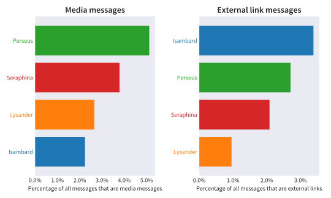
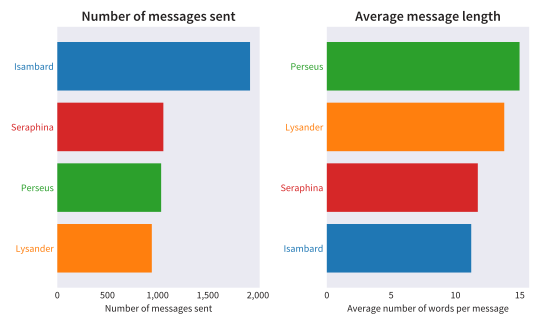
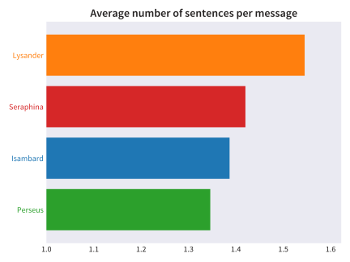
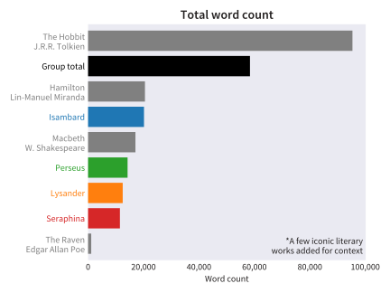
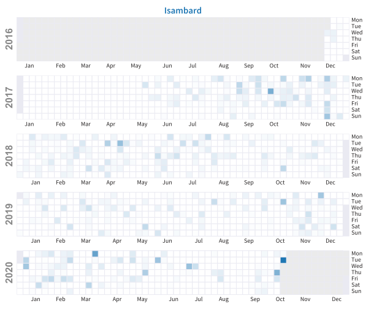
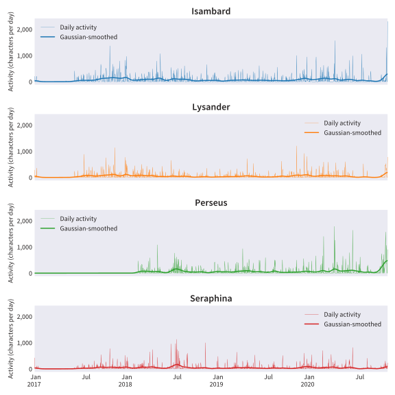
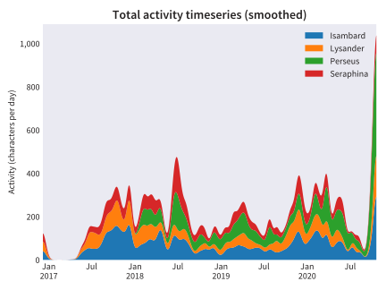
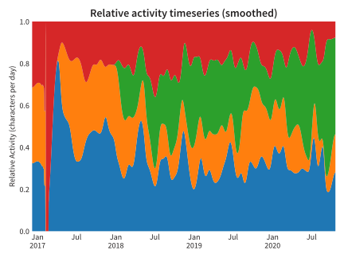
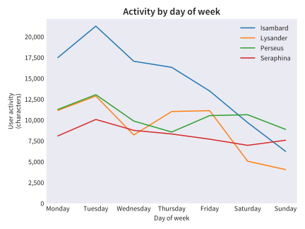
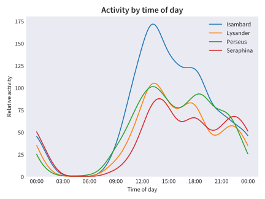
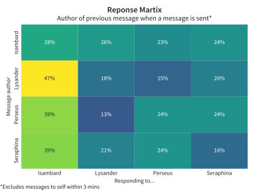
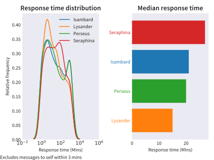
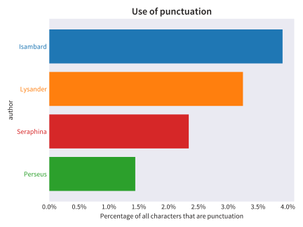
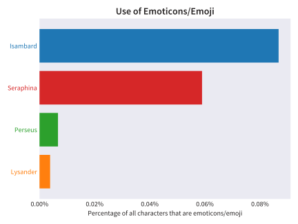
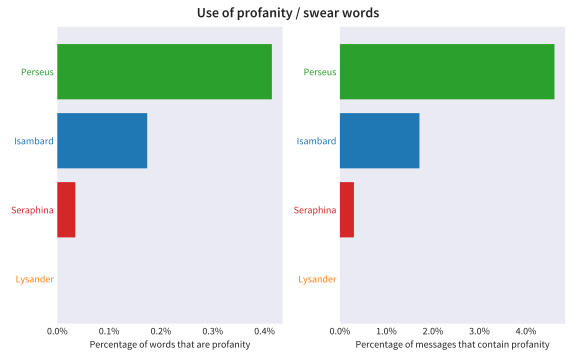
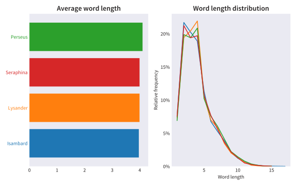
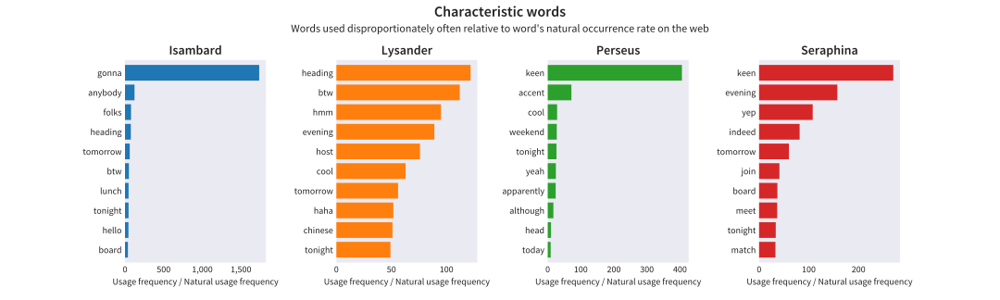
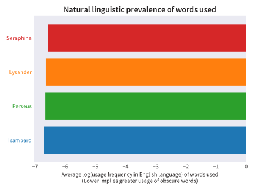
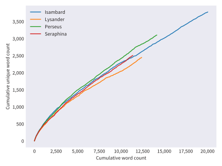
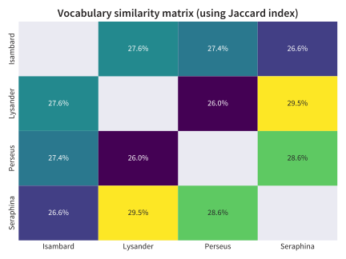

